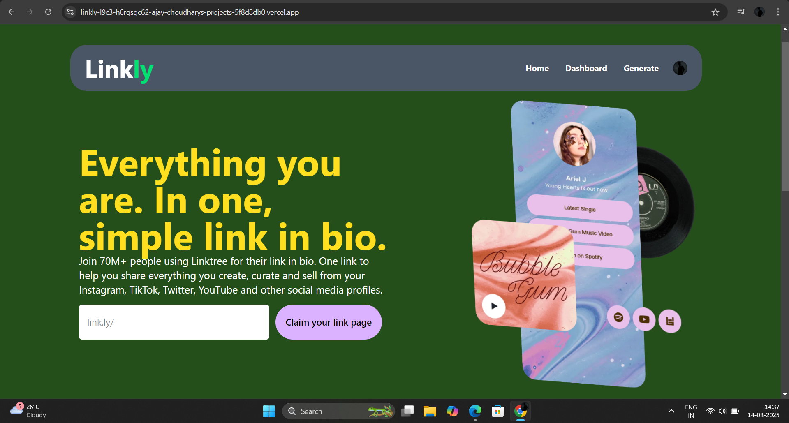

# 🌐 Linktree Clone

A **Linktree-like web application** built with **Next.js** and **MongoDB** that allows users to create a personalized page containing all their important links in one place. Includes **secure user authentication** so each user can manage their own profile and links.

---

## ✨ Features

- 🔐 **User Authentication** — Sign up, log in, and log out securely.
- 🗂 **Custom Profile** — Add, edit, and remove unlimited links.
- 🎨 **Responsive Design** — Works perfectly on mobile, tablet, and desktop.
- ⚡ **Fast Rendering** — Powered by **Next.js** for optimized performance.
- 📦 **Database Storage** — All user data stored securely in **MongoDB**.
- 🌐 **Public Profile URL** — Shareable link for others to access your page.

---

## 🛠 Tech Stack

- **Frontend:** Next.js, React, Tailwind CSS
- **Backend:** Next.js API Routes
- **Database:** MongoDB
- **Authentication:** Clerk/Auth.js (or other library)

---
## 🔗 Live Demo

[🌐 Click here to view the live site](https://your-deployed-project-link.com)

## 📸 Screenshots




---


## 🚀 Installation & Setup

1. **Clone the repository**
   ```bash
   git clone https://github.com/your-username/linktree-clone.git
   cd linktree-clone
